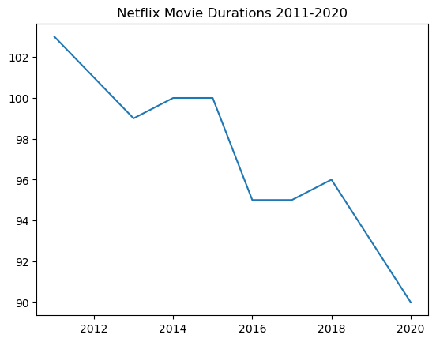
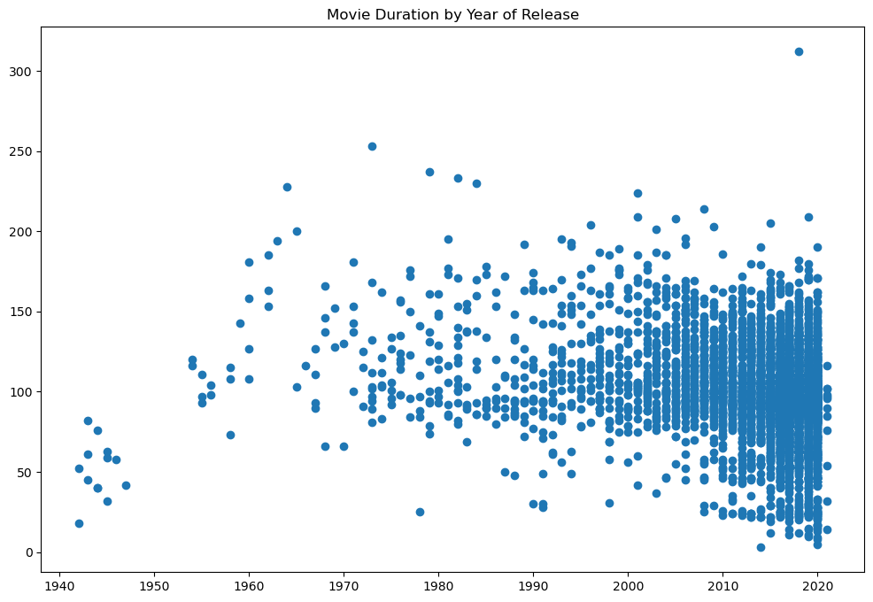
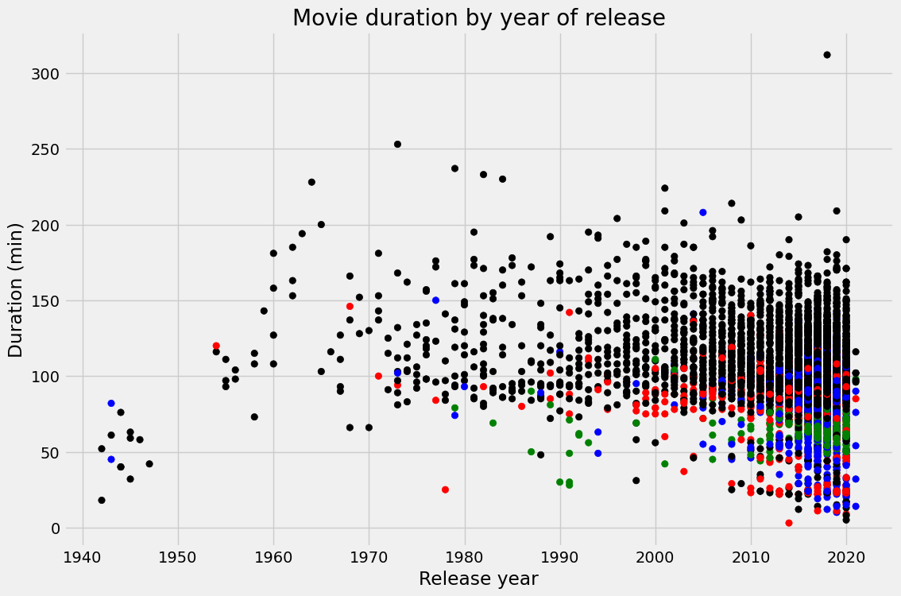

## 1. Loading your friend's data into a dictionary


```python
# Create the years and durations lists
years = [2011, 2012, 2013, 2014, 2015, 2016, 2017, 2018, 2019, 2020]
durations = [103, 101, 99, 100, 100, 95, 95, 96, 93,90]

# Create a dictionary with the two lists
movie_dict = {'years': years, 'durations': durations}

# Print the dictionary
movie_dict
```


    {'years': [2011, 2012, 2013, 2014, 2015, 2016, 2017, 2018, 2019, 2020],
     'durations': [103, 101, 99, 100, 100, 95, 95, 96, 93, 90]}


## 2. Creating a DataFrame from a dictionary


```python
# Import pandas under its usual alias
import pandas as pd
```


```python
# Create a DataFrame from the dictionary
durations_df = pd.DataFrame(movie_dict)

# Print the DataFrame
print(durations_df)
```

       years  durations
    0   2011        103
    1   2012        101
    2   2013         99
    3   2014        100
    4   2015        100
    5   2016         95
    6   2017         95
    7   2018         96
    8   2019         93
    9   2020         90
    

## 3. A visual inspection of our data


```python
# Import matplotlib.pyplot under its usual alias and create a figure
import  matplotlib.pyplot as plt
fig = plt.figure()

# Draw a line plot of release_years and durations
plt.plot(durations_df['years'], durations_df['durations'])

# Create a title
plt.title("Netflix Movie Durations 2011-2020")

# Show the plot
plt.show()
```


    

    


## 4. Loading the rest of the data from a CSV


```python
import pandas as pd
# Read in the CSV as a DataFrame
netflix_df = pd.read_csv('C:/Users/maria/OneDrive/Documents/datasets/netflix_data.csv')

# Print the first five rows of the DataFrame
netflix_df.head()
```


<div>
<style scoped>
    .dataframe tbody tr th:only-of-type {
        vertical-align: middle;
    }

    .dataframe tbody tr th {
        vertical-align: top;
    }

    .dataframe thead th {
        text-align: right;
    }
</style>
<table border="1" class="dataframe">
  <thead>
    <tr style="text-align: right;">
      <th></th>
      <th>show_id</th>
      <th>type</th>
      <th>title</th>
      <th>director</th>
      <th>cast</th>
      <th>country</th>
      <th>date_added</th>
      <th>release_year</th>
      <th>duration</th>
      <th>description</th>
      <th>genre</th>
    </tr>
  </thead>
  <tbody>
    <tr>
      <th>0</th>
      <td>s1</td>
      <td>TV Show</td>
      <td>3%</td>
      <td>NaN</td>
      <td>João Miguel, Bianca Comparato, Michel Gomes, R...</td>
      <td>Brazil</td>
      <td>August 14, 2020</td>
      <td>2020</td>
      <td>4</td>
      <td>In a future where the elite inhabit an island ...</td>
      <td>International TV</td>
    </tr>
    <tr>
      <th>1</th>
      <td>s2</td>
      <td>Movie</td>
      <td>7:19</td>
      <td>Jorge Michel Grau</td>
      <td>Demián Bichir, Héctor Bonilla, Oscar Serrano, ...</td>
      <td>Mexico</td>
      <td>December 23, 2016</td>
      <td>2016</td>
      <td>93</td>
      <td>After a devastating earthquake hits Mexico Cit...</td>
      <td>Dramas</td>
    </tr>
    <tr>
      <th>2</th>
      <td>s3</td>
      <td>Movie</td>
      <td>23:59</td>
      <td>Gilbert Chan</td>
      <td>Tedd Chan, Stella Chung, Henley Hii, Lawrence ...</td>
      <td>Singapore</td>
      <td>December 20, 2018</td>
      <td>2011</td>
      <td>78</td>
      <td>When an army recruit is found dead, his fellow...</td>
      <td>Horror Movies</td>
    </tr>
    <tr>
      <th>3</th>
      <td>s4</td>
      <td>Movie</td>
      <td>9</td>
      <td>Shane Acker</td>
      <td>Elijah Wood, John C. Reilly, Jennifer Connelly...</td>
      <td>United States</td>
      <td>November 16, 2017</td>
      <td>2009</td>
      <td>80</td>
      <td>In a postapocalyptic world, rag-doll robots hi...</td>
      <td>Action</td>
    </tr>
    <tr>
      <th>4</th>
      <td>s5</td>
      <td>Movie</td>
      <td>21</td>
      <td>Robert Luketic</td>
      <td>Jim Sturgess, Kevin Spacey, Kate Bosworth, Aar...</td>
      <td>United States</td>
      <td>January 1, 2020</td>
      <td>2008</td>
      <td>123</td>
      <td>A brilliant group of students become card-coun...</td>
      <td>Dramas</td>
    </tr>
  </tbody>
</table>
</div>


## 5. Filtering for movies!


```python
# Subset the DataFrame for type "Movie"
netflix_df_movies_only = netflix_df[netflix_df["type"] == "Movie"]

# Select only the columns of interest
netflix_movies_col_subset = netflix_df_movies_only[['title', 'country', 'genre', 'release_year', 'duration']]

# Print the first five rows of the new DataFrame
netflix_movies_col_subset[0:5]
```


<div>
<style scoped>
    .dataframe tbody tr th:only-of-type {
        vertical-align: middle;
    }

    .dataframe tbody tr th {
        vertical-align: top;
    }

    .dataframe thead th {
        text-align: right;
    }
</style>
<table border="1" class="dataframe">
  <thead>
    <tr style="text-align: right;">
      <th></th>
      <th>title</th>
      <th>country</th>
      <th>genre</th>
      <th>release_year</th>
      <th>duration</th>
    </tr>
  </thead>
  <tbody>
    <tr>
      <th>1</th>
      <td>7:19</td>
      <td>Mexico</td>
      <td>Dramas</td>
      <td>2016</td>
      <td>93</td>
    </tr>
    <tr>
      <th>2</th>
      <td>23:59</td>
      <td>Singapore</td>
      <td>Horror Movies</td>
      <td>2011</td>
      <td>78</td>
    </tr>
    <tr>
      <th>3</th>
      <td>9</td>
      <td>United States</td>
      <td>Action</td>
      <td>2009</td>
      <td>80</td>
    </tr>
    <tr>
      <th>4</th>
      <td>21</td>
      <td>United States</td>
      <td>Dramas</td>
      <td>2008</td>
      <td>123</td>
    </tr>
    <tr>
      <th>6</th>
      <td>122</td>
      <td>Egypt</td>
      <td>Horror Movies</td>
      <td>2019</td>
      <td>95</td>
    </tr>
  </tbody>
</table>
</div>


## 6. Creating a scatter plot


```python
# Import matplotlib under its usual alias
import matplotlib.pyplot as plt
```


```python
# Create a figure and increase the figure size
fig = plt.figure(figsize=(12,8))

# Create a scatter plot of duration versus year

plt.scatter(netflix_movies_col_subset[['release_year']], netflix_movies_col_subset[['duration']])
# Create a title
plt.title("Movie Duration by Year of Release")

# Show the plot
plt.show()
```


    

    


## 7. Digging deeper


```python
# Filter for durations shorter than 60 minutes
short_movies = netflix_movies_col_subset[netflix_movies_col_subset['duration'] <60]

# Print the first 20 rows of short_movies
short_movies.head(20)
```


<div>
<style scoped>
    .dataframe tbody tr th:only-of-type {
        vertical-align: middle;
    }

    .dataframe tbody tr th {
        vertical-align: top;
    }

    .dataframe thead th {
        text-align: right;
    }
</style>
<table border="1" class="dataframe">
  <thead>
    <tr style="text-align: right;">
      <th></th>
      <th>title</th>
      <th>country</th>
      <th>genre</th>
      <th>release_year</th>
      <th>duration</th>
    </tr>
  </thead>
  <tbody>
    <tr>
      <th>35</th>
      <td>#Rucker50</td>
      <td>United States</td>
      <td>Documentaries</td>
      <td>2016</td>
      <td>56</td>
    </tr>
    <tr>
      <th>55</th>
      <td>100 Things to do Before High School</td>
      <td>United States</td>
      <td>Uncategorized</td>
      <td>2014</td>
      <td>44</td>
    </tr>
    <tr>
      <th>67</th>
      <td>13TH: A Conversation with Oprah Winfrey &amp; Ava ...</td>
      <td>NaN</td>
      <td>Uncategorized</td>
      <td>2017</td>
      <td>37</td>
    </tr>
    <tr>
      <th>101</th>
      <td>3 Seconds Divorce</td>
      <td>Canada</td>
      <td>Documentaries</td>
      <td>2018</td>
      <td>53</td>
    </tr>
    <tr>
      <th>146</th>
      <td>A 3 Minute Hug</td>
      <td>Mexico</td>
      <td>Documentaries</td>
      <td>2019</td>
      <td>28</td>
    </tr>
    <tr>
      <th>162</th>
      <td>A Christmas Special: Miraculous: Tales of Lady...</td>
      <td>France</td>
      <td>Uncategorized</td>
      <td>2016</td>
      <td>22</td>
    </tr>
    <tr>
      <th>171</th>
      <td>A Family Reunion Christmas</td>
      <td>United States</td>
      <td>Uncategorized</td>
      <td>2019</td>
      <td>29</td>
    </tr>
    <tr>
      <th>177</th>
      <td>A Go! Go! Cory Carson Christmas</td>
      <td>United States</td>
      <td>Children</td>
      <td>2020</td>
      <td>22</td>
    </tr>
    <tr>
      <th>178</th>
      <td>A Go! Go! Cory Carson Halloween</td>
      <td>NaN</td>
      <td>Children</td>
      <td>2020</td>
      <td>22</td>
    </tr>
    <tr>
      <th>179</th>
      <td>A Go! Go! Cory Carson Summer Camp</td>
      <td>NaN</td>
      <td>Children</td>
      <td>2020</td>
      <td>21</td>
    </tr>
    <tr>
      <th>181</th>
      <td>A Grand Night In: The Story of Aardman</td>
      <td>United Kingdom</td>
      <td>Documentaries</td>
      <td>2015</td>
      <td>59</td>
    </tr>
    <tr>
      <th>200</th>
      <td>A Love Song for Latasha</td>
      <td>United States</td>
      <td>Documentaries</td>
      <td>2020</td>
      <td>20</td>
    </tr>
    <tr>
      <th>220</th>
      <td>A Russell Peters Christmas</td>
      <td>Canada</td>
      <td>Stand-Up</td>
      <td>2011</td>
      <td>44</td>
    </tr>
    <tr>
      <th>233</th>
      <td>A StoryBots Christmas</td>
      <td>United States</td>
      <td>Children</td>
      <td>2017</td>
      <td>26</td>
    </tr>
    <tr>
      <th>237</th>
      <td>A Tale of Two Kitchens</td>
      <td>United States</td>
      <td>Documentaries</td>
      <td>2019</td>
      <td>30</td>
    </tr>
    <tr>
      <th>242</th>
      <td>A Trash Truck Christmas</td>
      <td>NaN</td>
      <td>Children</td>
      <td>2020</td>
      <td>28</td>
    </tr>
    <tr>
      <th>247</th>
      <td>A Very Murray Christmas</td>
      <td>United States</td>
      <td>Comedies</td>
      <td>2015</td>
      <td>57</td>
    </tr>
    <tr>
      <th>285</th>
      <td>Abominable Christmas</td>
      <td>United States</td>
      <td>Children</td>
      <td>2012</td>
      <td>44</td>
    </tr>
    <tr>
      <th>295</th>
      <td>Across Grace Alley</td>
      <td>United States</td>
      <td>Dramas</td>
      <td>2013</td>
      <td>24</td>
    </tr>
    <tr>
      <th>305</th>
      <td>Adam Devine: Best Time of Our Lives</td>
      <td>United States</td>
      <td>Stand-Up</td>
      <td>2019</td>
      <td>59</td>
    </tr>
  </tbody>
</table>
</div>


## 8. Marking non-feature films


```python
# Define an empty list
colors = []
# Iterate over rows of netflix_movies_col_subset
for lab, row in netflix_movies_col_subset.iterrows() :
    if row['genre'] ==  "Children":
        colors.append('red')
    elif row['genre'] == "Documentaries":
        colors.append("blue")
    elif row['genre'] =="Stand-Up" :
        colors.append("green")
    else:
        colors.append("black")
        
# Inspect the first 10 values in your list        
print(colors[0:10])
```

    ['black', 'black', 'black', 'black', 'black', 'black', 'black', 'black', 'black', 'blue']
    

## 9. Plotting with color!


```python
# Set the figure style and initalize a new figure
plt.style.use('fivethirtyeight')
fig = plt.figure(figsize=(12,8))

# Create a scatter plot of duration versus release_year

plt.scatter(netflix_movies_col_subset[['release_year']], netflix_movies_col_subset[['duration']], c= colors)
# Create a title and axis labels
plt.title("Movie duration by year of release")
plt.xlabel("Release year")
plt.ylabel("Duration (min)")
# Show the plot
plt.show()
```


    

    


```python
help(plt.scatter
    )
```

    Help on function scatter in module matplotlib.pyplot:
    
    scatter(x, y, s=None, c=None, marker=None, cmap=None, norm=None, vmin=None, vmax=None, alpha=None, linewidths=None, *, edgecolors=None, plotnonfinite=False, data=None, **kwargs)
        A scatter plot of *y* vs. *x* with varying marker size and/or color.
        
        Parameters
        ----------
        x, y : float or array-like, shape (n, )
            The data positions.
        
        s : float or array-like, shape (n, ), optional
            The marker size in points**2.
            Default is ``rcParams['lines.markersize'] ** 2``.
        
        c : array-like or list of colors or color, optional
            The marker colors. Possible values:
        
            - A scalar or sequence of n numbers to be mapped to colors using
              *cmap* and *norm*.
            - A 2D array in which the rows are RGB or RGBA.
            - A sequence of colors of length n.
            - A single color format string.
        
            Note that *c* should not be a single numeric RGB or RGBA sequence
            because that is indistinguishable from an array of values to be
            colormapped. If you want to specify the same RGB or RGBA value for
            all points, use a 2D array with a single row.  Otherwise, value-
            matching will have precedence in case of a size matching with *x*
            and *y*.
        
            If you wish to specify a single color for all points
            prefer the *color* keyword argument.
        
            Defaults to `None`. In that case the marker color is determined
            by the value of *color*, *facecolor* or *facecolors*. In case
            those are not specified or `None`, the marker color is determined
            by the next color of the ``Axes``' current "shape and fill" color
            cycle. This cycle defaults to :rc:`axes.prop_cycle`.
        
        marker : `~.markers.MarkerStyle`, default: :rc:`scatter.marker`
            The marker style. *marker* can be either an instance of the class
            or the text shorthand for a particular marker.
            See :mod:`matplotlib.markers` for more information about marker
            styles.
        
        cmap : str or `~matplotlib.colors.Colormap`, default: :rc:`image.cmap`
            A `.Colormap` instance or registered colormap name. *cmap* is only
            used if *c* is an array of floats.
        
        norm : `~matplotlib.colors.Normalize`, default: None
            If *c* is an array of floats, *norm* is used to scale the color
            data, *c*, in the range 0 to 1, in order to map into the colormap
            *cmap*.
            If *None*, use the default `.colors.Normalize`.
        
        vmin, vmax : float, default: None
            *vmin* and *vmax* are used in conjunction with the default norm to
            map the color array *c* to the colormap *cmap*. If None, the
            respective min and max of the color array is used.
            It is an error to use *vmin*/*vmax* when *norm* is given.
        
        alpha : float, default: None
            The alpha blending value, between 0 (transparent) and 1 (opaque).
        
        linewidths : float or array-like, default: :rc:`lines.linewidth`
            The linewidth of the marker edges. Note: The default *edgecolors*
            is 'face'. You may want to change this as well.
        
        edgecolors : {'face', 'none', *None*} or color or sequence of color, default: :rc:`scatter.edgecolors`
            The edge color of the marker. Possible values:
        
            - 'face': The edge color will always be the same as the face color.
            - 'none': No patch boundary will be drawn.
            - A color or sequence of colors.
        
            For non-filled markers, *edgecolors* is ignored. Instead, the color
            is determined like with 'face', i.e. from *c*, *colors*, or
            *facecolors*.
        
        plotnonfinite : bool, default: False
            Whether to plot points with nonfinite *c* (i.e. ``inf``, ``-inf``
            or ``nan``). If ``True`` the points are drawn with the *bad*
            colormap color (see `.Colormap.set_bad`).
        
        Returns
        -------
        `~matplotlib.collections.PathCollection`
        
        Other Parameters
        ----------------
        data : indexable object, optional
            If given, the following parameters also accept a string ``s``, which is
            interpreted as ``data[s]`` (unless this raises an exception):
        
            *x*, *y*, *s*, *linewidths*, *edgecolors*, *c*, *facecolor*, *facecolors*, *color*
        **kwargs : `~matplotlib.collections.Collection` properties
        
        See Also
        --------
        plot : To plot scatter plots when markers are identical in size and
            color.
        
        Notes
        -----
        * The `.plot` function will be faster for scatterplots where markers
          don't vary in size or color.
        
        * Any or all of *x*, *y*, *s*, and *c* may be masked arrays, in which
          case all masks will be combined and only unmasked points will be
          plotted.
        
        * Fundamentally, scatter works with 1D arrays; *x*, *y*, *s*, and *c*
          may be input as N-D arrays, but within scatter they will be
          flattened. The exception is *c*, which will be flattened only if its
          size matches the size of *x* and *y*.
    
    

## 10. What next?


```python
# Are we certain that movies are getting shorter?
are_movies_getting_shorter = "maybe"
```


```python

```


```python

```
